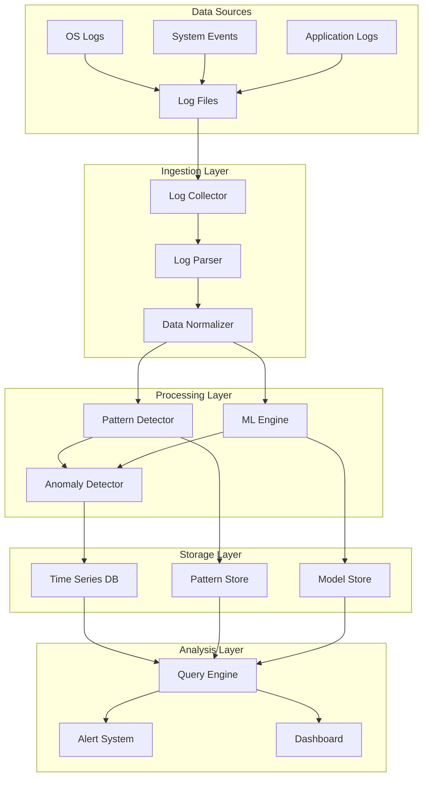

# Design Document: Intelligent Log Analysis System

## Overview

The Intelligent Log Analysis System is a comprehensive solution that combines machine learning, pattern recognition, and database technologies to provide automated log analysis, anomaly detection, and predictive insights. The system processes OS logs in real-time, identifies patterns and anomalies, and predicts potential system issues before they occur.

The architecture follows a modular design with clear separation between data ingestion, processing, storage, and presentation layers. This enables scalability, maintainability, and the ability to adapt to different log formats and analysis requirements.

## Architecture

The system follows a layered architecture with the following components:



### Component Responsibilities

- **Log Collector**: Monitors log sources and ingests new entries
- **Log Parser**: Extracts structured data from raw log entries using algorithms like Drain
- **Pattern Detector**: Identifies recurring patterns and templates in log data
- **ML Engine**: Trains models and generates predictions for system behavior
- **Anomaly Detector**: Identifies deviations from normal patterns
- **Storage Components**: Persist logs, patterns, and models efficiently
- **Query Engine**: Provides fast access to historical and real-time data
- **Alert System**: Notifies administrators of critical findings

## Components and Interfaces

### Log Collector Interface

```python
class LogCollector:
    def start_monitoring(self, sources: List[LogSource]) -> None
    def stop_monitoring(self) -> None
    def get_status(self) -> CollectorStatus
    def configure_source(self, source: LogSource, config: SourceConfig) -> None
```

**Key Features:**
- File system monitoring using inotify/ReadDirectoryChangesW
- Support for log rotation and archival
- Configurable polling intervals and batch sizes
- Automatic retry with exponential backoff

### Log Parser Interface

Based on research, the system will use the Drain algorithm for log parsing, which has proven effective for real-time log template extraction:

```python
class LogParser:
    def parse_entry(self, raw_log: str) -> ParsedLog
    def get_template(self, log_id: str) -> LogTemplate
    def update_templates(self, feedback: List[TemplateFeedback]) -> None
    def get_parsing_stats(self) -> ParsingStats
```

**Drain Algorithm Implementation:**
- Fixed-depth parsing tree for efficient template matching
- Configurable similarity threshold for template grouping
- Support for variable extraction from log messages
- Online learning capability for new log patterns

### Pattern Detector Interface

```python
class PatternDetector:
    def analyze_sequence(self, logs: List[ParsedLog]) -> List[Pattern]
    def update_baselines(self, patterns: List[Pattern]) -> None
    def get_pattern_frequency(self, pattern_id: str, timerange: TimeRange) -> FrequencyStats
    def classify_pattern(self, pattern: Pattern) -> PatternClassification
```

**Pattern Recognition Features:**
- Sequence pattern mining using sliding window approach
- Statistical analysis of pattern frequencies
- Temporal pattern analysis for time-based correlations
- Pattern clustering for similar behavior grouping

### ML Engine Interface

```python
class MLEngine:
    def train_model(self, training_data: TrainingDataset) -> ModelMetrics
    def predict(self, current_state: SystemState) -> List[Prediction]
    def retrain_incremental(self, new_data: List[LogEntry]) -> None
    def explain_prediction(self, prediction: Prediction) -> Explanation
```

**Machine Learning Approach:**
- Ensemble methods combining multiple algorithms (Random Forest, LSTM, Isolation Forest)
- Semi-supervised learning to handle limited labeled data
- Feature engineering from log patterns and system metrics
- Model uncertainty quantification for prediction confidence

### Anomaly Detector Interface

```python
class AnomalyDetector:
    def detect_anomalies(self, logs: List[ParsedLog]) -> List[Anomaly]
    def update_baseline(self, normal_patterns: List[Pattern]) -> None
    def calculate_severity(self, anomaly: Anomaly) -> SeverityScore
    def get_detection_metrics(self) -> DetectionMetrics
```

**Anomaly Detection Methods:**
- Statistical methods for numerical log values
- Sequence-based anomaly detection for log patterns
- Contextual anomaly detection considering system state
- Multi-level severity scoring based on deviation magnitude

## Data Models

### Core Data Structures

```python
@dataclass
class ParsedLog:
    timestamp: datetime
    source: str
    level: LogLevel
    template_id: str
    parameters: Dict[str, Any]
    raw_message: str
    metadata: Dict[str, Any]

@dataclass
class LogTemplate:
    template_id: str
    pattern: str
    parameter_types: Dict[str, Type]
    frequency: int
    first_seen: datetime
    last_seen: datetime

@dataclass
class Pattern:
    pattern_id: str
    sequence: List[str]
    frequency: int
    confidence: float
    temporal_info: TemporalPattern
    classification: PatternType

@dataclass
class Anomaly:
    anomaly_id: str
    timestamp: datetime
    severity: SeverityLevel
    description: str
    affected_logs: List[str]
    deviation_score: float
    context: Dict[str, Any]

@dataclass
class Prediction:
    prediction_id: str
    timestamp: datetime
    predicted_event: str
    probability: float
    time_horizon: timedelta
    contributing_factors: List[str]
    confidence_interval: Tuple[float, float]
```

### Database Schema Design

**Time Series Storage (InfluxDB):**
- Measurement: `log_events`
- Tags: source, level, template_id, host
- Fields: count, processing_time, anomaly_score
- Timestamp: log occurrence time

**Pattern Storage (PostgreSQL):**
- Tables: patterns, pattern_sequences, pattern_frequencies
- Indexes on timestamp, pattern_id, and frequency columns
- Partitioning by date for efficient querying

**Model Storage:**
- Serialized models in binary format
- Version control for model updates
- Metadata including training metrics and feature importance

## Correctness Properties

*A property is a characteristic or behavior that should hold true across all valid executions of a system—essentially, a formal statement about what the system should do. Properties serve as the bridge between human-readable specifications and machine-verifiable correctness guarantees.*

### Property 1: Log Discovery and Ingestion
*For any* set of log files placed in standard system locations, the Log_Analyzer should automatically detect and successfully ingest all files without manual intervention.
**Validates: Requirements 1.1**

### Property 2: Real-time Processing Latency
*For any* new log entry written to monitored sources, the Log_Analyzer should process it within 5 seconds of creation.
**Validates: Requirements 1.2**

### Property 3: Log Rotation Resilience
*For any* log file that undergoes rotation or archival, the Log_Analyzer should continue processing without losing any log entries.
**Validates: Requirements 1.3**

### Property 4: Multi-format Support
*For any* log entry in supported formats (syslog, Windows Event Log, application-specific), the Log_Analyzer should successfully parse and extract structured information.
**Validates: Requirements 1.4**

### Property 5: Ingestion Error Recovery
*For any* ingestion failure, the Log_Analyzer should retry with exponential backoff and log the failure details for debugging.
**Validates: Requirements 1.5**

### Property 6: Pattern Template Extraction
*For any* sequence of log entries containing recurring patterns, the Pattern_Detector should identify and extract the common templates with variable parameters.
**Validates: Requirements 2.1, 2.3**

### Property 7: Pattern Frequency Analysis
*For any* set of similar log patterns, the Pattern_Detector should group them correctly and maintain accurate frequency statistics over time.
**Validates: Requirements 2.2**

### Property 8: Pattern Classification
*For any* newly detected pattern, the Pattern_Detector should classify it as normal or anomalous based on historical baseline data with appropriate confidence scores.
**Validates: Requirements 2.4, 2.5**

### Property 9: ML Model Training
*For any* sufficient historical dataset, the ML_Engine should successfully train prediction models and generate meaningful accuracy metrics.
**Validates: Requirements 3.1**

### Property 10: Prediction Generation
*For any* current system state with log patterns, the ML_Engine should generate probability scores for potential issues within the specified 24-hour timeframe.
**Validates: Requirements 3.2**

### Property 11: Continuous Learning
*For any* new training data and feedback provided to the ML_Engine, the system should incorporate this information to improve model accuracy through retraining.
**Validates: Requirements 3.3**

### Property 12: Alert Triggering
*For any* prediction with confidence exceeding 80%, the ML_Engine should trigger appropriate alerts through the Alert_System with explanatory information.
**Validates: Requirements 3.4, 3.5**

### Property 13: Data Persistence Completeness
*For any* log entry, pattern, or prediction processed by the system, all required metadata (timestamps, sources, severity, confidence scores, contributing factors) should be correctly stored in the DBMS.
**Validates: Requirements 4.1, 4.2, 4.3**

### Property 14: Query Performance
*For any* historical data query spanning up to 30 days, the DBMS should return results within 2 seconds.
**Validates: Requirements 4.4**

### Property 15: Data Retention Management
*For any* data retention policy configuration, the DBMS should automatically clean up old data while preserving critical historical information according to the specified rules.
**Validates: Requirements 4.5**

### Property 16: Baseline Anomaly Detection
*For any* log pattern that deviates significantly from established baselines, the Log_Analyzer should flag it as an anomaly with appropriate severity scoring.
**Validates: Requirements 5.1, 5.2**

### Property 17: Threat Classification
*For any* detected anomaly, the Log_Analyzer should distinguish between benign anomalies and potential security threats using contextual analysis.
**Validates: Requirements 5.3**

### Property 18: Critical Alert Timing
*For any* critical anomaly identified by the system, the Alert_System should notify administrators within 30 seconds.
**Validates: Requirements 5.4**

### Property 19: Feedback Learning
*For any* administrator feedback provided on anomaly classifications, the Log_Analyzer should incorporate this feedback to improve future detection accuracy.
**Validates: Requirements 5.5**

### Property 20: Multi-channel Alert Delivery
*For any* critical event requiring notification, the Alert_System should successfully deliver alerts through all configured channels (email, SMS, webhooks) with complete context and recommended actions.
**Validates: Requirements 6.1, 6.2, 6.3**

### Property 21: Alert Rate Limiting
*For any* period of widespread system issues generating multiple alerts, the Alert_System should implement rate limiting to prevent notification flooding while ensuring critical alerts are still delivered.
**Validates: Requirements 6.4**

### Property 22: Alert Response Tracking
*For any* alert sent to administrators, the Alert_System should track acknowledgment times and outcomes for performance analysis.
**Validates: Requirements 6.5**

### Property 23: Configuration Management
*For any* configuration change made to log sources, analysis parameters, or alert thresholds, the Log_Analyzer should apply the changes immediately without requiring system restart.
**Validates: Requirements 7.1, 7.2**

### Property 24: Dashboard Data Accuracy
*For any* system status, processing statistics, or recent findings, the dashboard should display accurate and up-to-date information reflecting the current system state.
**Validates: Requirements 7.3**

### Property 25: Feedback Interface
*For any* prediction or anomaly presented to administrators, the system should provide a mechanism to collect feedback and incorporate it into future analysis.
**Validates: Requirements 7.4**

### Property 26: Export/Import Consistency
*For any* analysis results or configuration data exported from the system, importing it into a new instance should reproduce the same system behavior and state.
**Validates: Requirements 7.5**

### Property 27: Processing Throughput
*For any* standard hardware configuration, the Log_Analyzer should process at least 10,000 log entries per second while maintaining analysis quality.
**Validates: Requirements 8.1**

### Property 28: Auto-scaling Behavior
*For any* increase in log volume, the Log_Analyzer should automatically scale processing capacity within available resource limits to maintain performance.
**Validates: Requirements 8.2**

### Property 29: Accuracy Under Load
*For any* high-volume concurrent log stream processing, the Log_Analyzer should maintain the same analysis accuracy as under normal load conditions.
**Validates: Requirements 8.3**

### Property 30: Resource Prioritization
*For any* resource-constrained scenario, the Log_Analyzer should prioritize processing of critical log sources and high-severity events over less important data.
**Validates: Requirements 8.4**

### Property 31: Performance Monitoring
*For any* system operation, the Log_Analyzer should collect and report accurate performance metrics and resource utilization data for monitoring purposes.
**Validates: Requirements 8.5**

## Error Handling

The system implements comprehensive error handling across all components:

### Ingestion Layer Errors
- **File Access Errors**: Retry with exponential backoff, log failures, continue with other sources
- **Parsing Errors**: Log unparseable entries, attempt alternative parsers, maintain processing flow
- **Network Errors**: Implement circuit breaker pattern for remote log sources

### Processing Layer Errors
- **ML Model Errors**: Fallback to statistical methods, retrain models with new data
- **Pattern Detection Errors**: Use cached patterns, log anomalies for manual review
- **Memory Errors**: Implement graceful degradation, prioritize critical processing

### Storage Layer Errors
- **Database Connection Errors**: Implement connection pooling, retry logic, local caching
- **Disk Space Errors**: Trigger data cleanup, alert administrators, implement emergency retention
- **Query Timeout Errors**: Optimize queries, implement query result caching

### Alert System Errors
- **Notification Delivery Errors**: Retry with alternative channels, log delivery failures
- **Rate Limiting Errors**: Queue alerts, implement priority-based delivery
- **Configuration Errors**: Validate configurations, provide clear error messages

## Testing Strategy

The system will employ a dual testing approach combining unit tests and property-based tests to ensure comprehensive coverage and correctness validation.

### Unit Testing Approach
Unit tests will focus on:
- **Specific Examples**: Test known log formats and expected parsing results
- **Edge Cases**: Empty logs, malformed entries, boundary conditions
- **Error Conditions**: Network failures, disk full scenarios, invalid configurations
- **Integration Points**: Component interfaces and data flow validation

### Property-Based Testing Approach
Property-based tests will validate universal properties using a minimum of 100 iterations per test:
- **Log Processing Properties**: Verify parsing consistency across generated log variations
- **Pattern Detection Properties**: Test pattern identification with synthetic log sequences
- **ML Prediction Properties**: Validate prediction consistency with generated system states
- **Performance Properties**: Test throughput and latency under various load conditions

### Testing Framework Configuration
- **Framework**: pytest with Hypothesis for property-based testing
- **Test Iterations**: Minimum 100 iterations per property test
- **Test Tagging**: Each property test tagged with format: **Feature: intelligent-log-analysis, Property {number}: {property_text}**
- **Coverage Requirements**: Minimum 90% code coverage for core components
- **Performance Benchmarks**: Automated performance regression testing

### Test Data Generation
- **Synthetic Log Generation**: Create realistic log entries with controlled patterns
- **Anomaly Injection**: Generate known anomalies for detection validation
- **Load Testing**: Simulate high-volume log streams for scalability testing
- **Historical Data Simulation**: Generate time-series data for ML model training

The testing strategy ensures that both specific behaviors and universal properties are validated, providing confidence in system correctness and reliability across all operational scenarios.